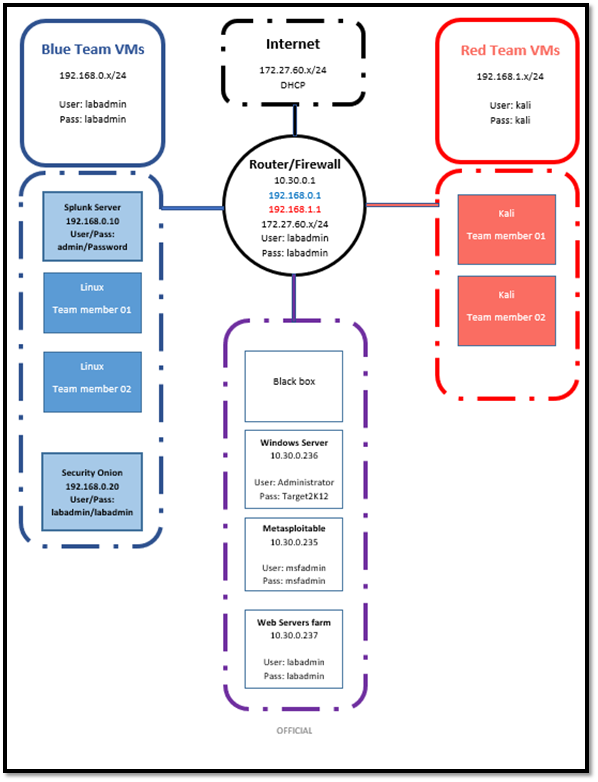
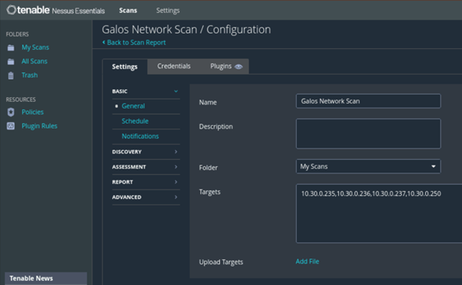
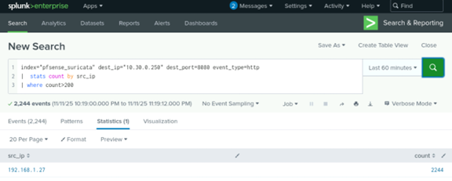
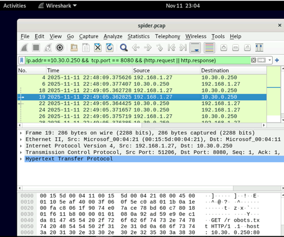

# Gelos Enterprise Cyber Security Project

This repository contains my Certificate IV in Cyber Security group project work for an enterprise called **Gelos**. The project simulated a full cyber security engagement with Data Trust, red team and blue team perspectives.

## Contents

- Nessus network scan report
- Data Trust risk & governance report
- Red team playbook
- Blue team observation checklist
- Incident response & end-of-project report

## Key Activities

- Performed Nessus scanning of Gelos network assets.
- Assessed risks and controls for the Data Trust function.
- Designed a red team playbook to simulate attack paths.
- Documented blue team observations during an incident response exercise.
- Summarised risk mitigation and monitoring strategies.

## Example Screenshots

## Skills Demonstrated

- Enterprise risk assessment  
- Vulnerability management (Nessus)  
- Red/blue team collaboration  
- Incident response documentation  
- Report writing & presentation
